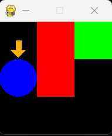
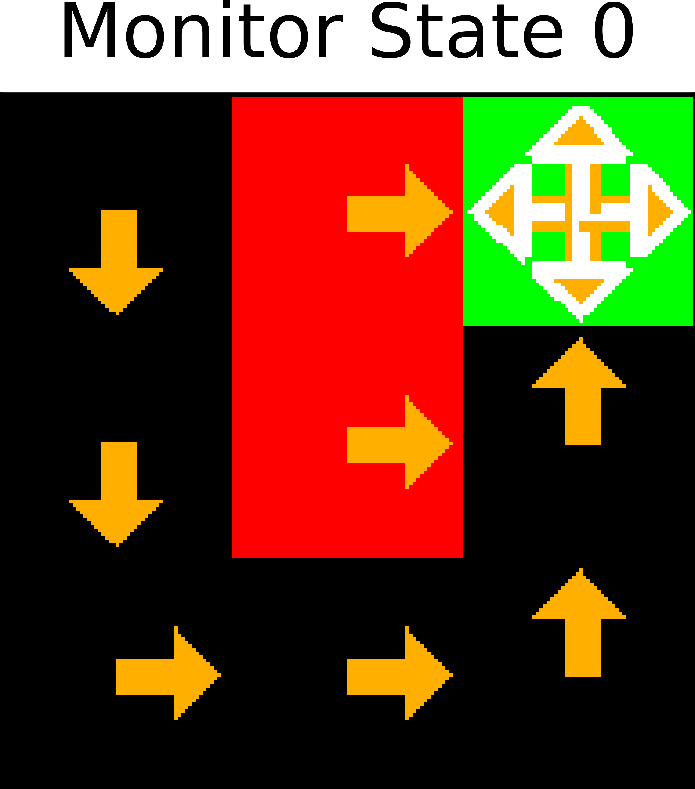
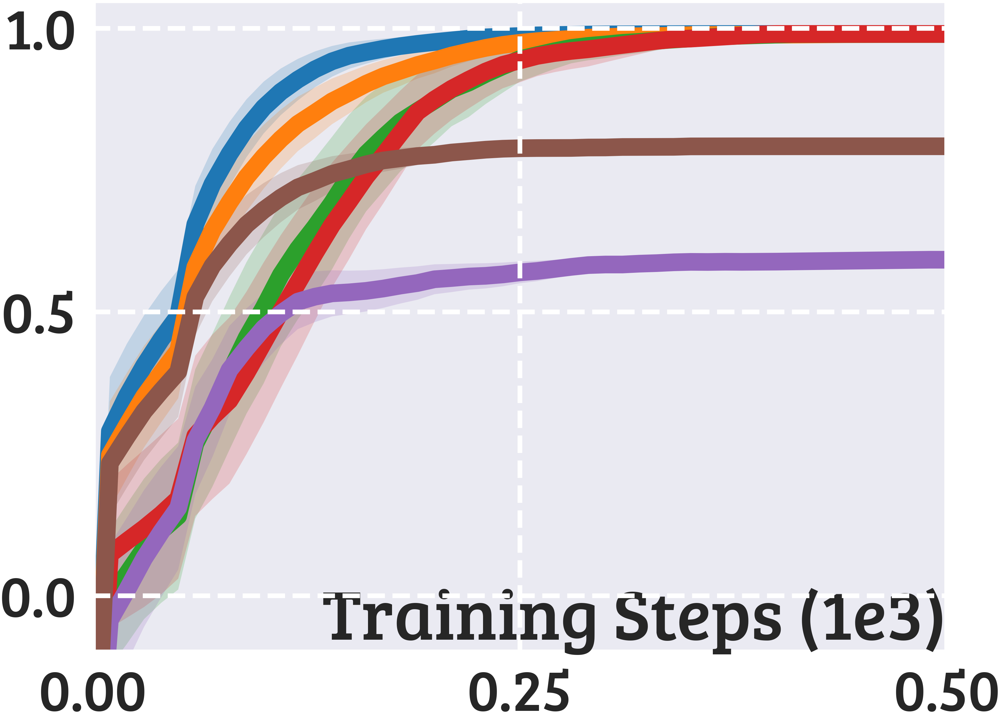
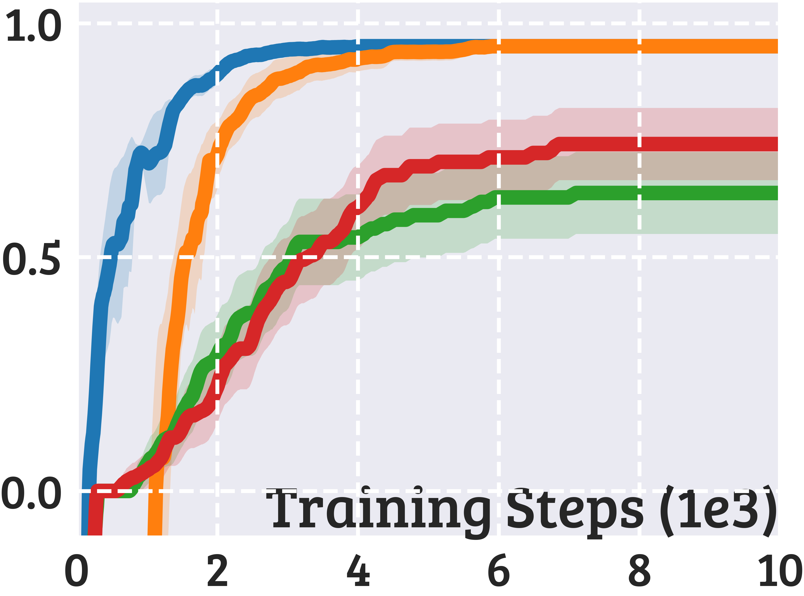
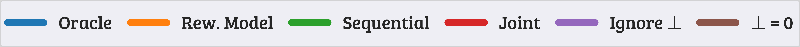

Source code of the paper [Monitored Markov Decision Processes](xxx).

## Install

To install and use our environments, run
```
pip install -r requirements.txt
cd src/gym-monitor
pip install -e .
```

To test and render an environment, run `python` and then
```python
import gymnasium
env = gymnasium.make("Gym-Monitor/Gridworld-Medium-3x3-v0", render_mode="human")
env.reset()
env.step(1)
env.render()
```

<p align="center">
  
</p>

Red tiles denote negative rewards, green tile is the goal, blue circle is the agent,
the arrow means that the agent moved down.


## Hydra Configs
We use [Hydra](https://hydra.cc/docs/intro/) to configure our experiments.  
Hyperparameters and other settings are defined in YAML files in the `configs/` folder.  
Most of the configuration is self-explanatory. Some keys you may need to change are the following:
- [WandB](https://wandb.ai/site) settings and Hydra log directories in `configs/default.yaml`,
- Folder `experiment.datadir` in `configs/default.yaml` (where `npy` data is saved),
- Folder `experiment.debugdir` in `configs/default.yaml` (where agent pics are saved),
- Steps, learning rate, epsilon decay, and other training parameters in `configs/experiment/`.


## Quick Run
To try the Oracle algorithm on the Penalty MonMDP with the default configuration,
and save some debug data, run
```
python main.py monitor=binary_stateless agent.critic.strategy=oracle experiment.debugdir=debug
```

This will save pics to easily visualize the Q-function and the greedy policy.  
Everything will be saved in `debug/`, in subfolders depending on the environment and the monitor IDs.  

<p align="center">
   &nbsp;&nbsp;&nbsp;&nbsp;&nbsp;
  
</p>

In the policy pic (left), arrows denote the action executed in each tile.
- Orange arrows do not ask for monitoring,
- Empty white arrows do ask for monitoring,
- Orange arrows with white borders can do both randomly.

The policy is random in the goal tile because that is a terminal state.

In the Q-function pic (right), the heatmaps denote the value of the 4D Q-table, where
`Q[i,j,k,l]` is the Q-value of environment state `i`, monitor state `j`, environment action `k`, monitor action `l`.


## Sweeps
For a sweep over multiple jobs in parallel with Joblib, run
```
python main.py -m hydra/launcher=joblib hydra/sweeper=medium_det
```
Custom sweeps are defined in `configs/hydra/sweeper/`.  
You can further customize a sweep via command line. For example,
```
python main.py -m hydra/launcher=joblib hydra/sweeper=medium_det experiment.rng_seed="range(0, 10)" monitor=limited_time hydra.launcher.verbose=1000
```
Configs in `configs/hydra/sweeper/` hide the training progress bar of the agent, so we
suggest to pass `hydra.launcher.verbose=1000` to show the progress of the sweep.

If you have access to a SLURM-based cluster, you can submit multiple jobs,
each running a chunk of the sweep with Joblib. Refer to `submitit_jobs.py` for an example.


## Plot Data From Sweeps
Experiments will save the expected discounted return of the ε-greedy (training)
and greedy (testing) policies in `npy` files (default dir is `data/`).  
If you want to zip and copy only the data needed for plotting, run
```
find data -type f -name "*test*.npy" -print0 | tar -czvf data.tar.gz --null -T -
```

To plot expected return curves, use `plot_curves.py`. This script takes two arguments:
- `-c` is the config file that defines where to save plots, axes limits, axes ticks,
  what algorithms to show, and so on. Default configs are located in `configs/plots/`.
- `-f` is the folder where data from the sweep is located.

For example, running
```
python plot_curves.py -c configs/plots/deterministic_appendix.py -f data/iGym-Monitor/
```
Will generate many plots like these two, and save them in `data/iGym-Monitor/deterministic_appendix`.

<p align="center">
   &nbsp;&nbsp;&nbsp;&nbsp;&nbsp;
  
</p>

Finally, `python plot_legend.py` will generate a separate pic with only the legend.

<p align="center">
  
</p>
